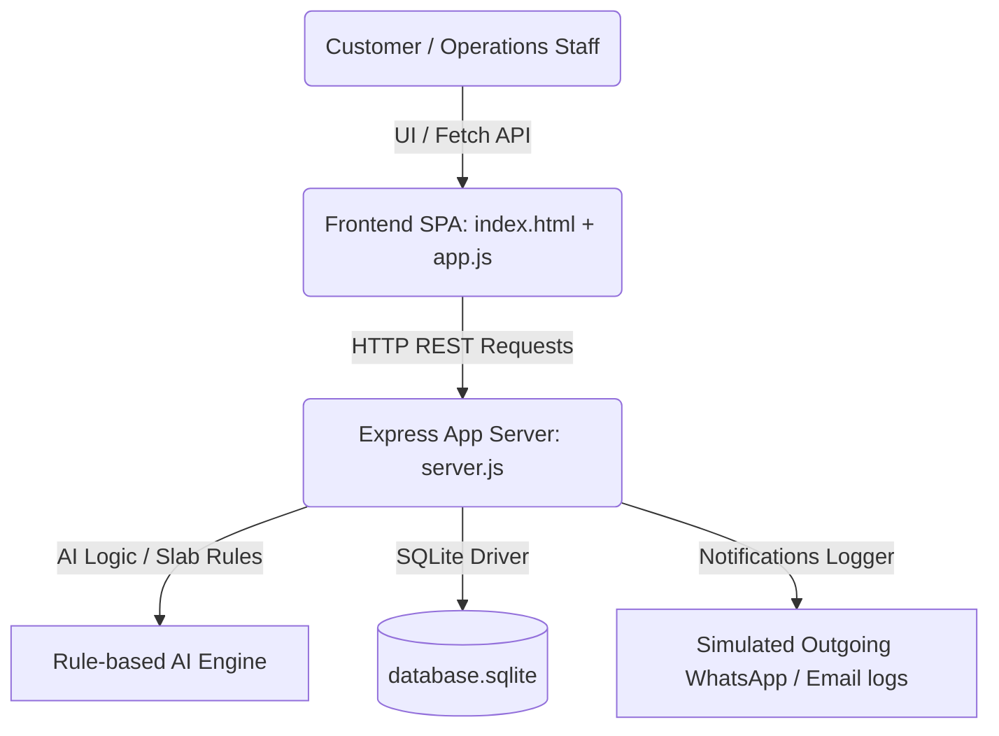

# Air Freight Quotation Management System
## Internship Reference Implementation — ORBEM Solutions Private Limited

A web-based prototype application that automates air cargo booking, dynamic volumetric-weight freight quotations, tracking milestones, warehouse storage layout, invoice billing, and customer insurance claim resolutions, powered by rule-based workflows and smart AI logistics assistants.

---

## 📖 Table of Contents
1. [Project Overview](#-project-overview)
2. [Problem Statement](#-the-problem-it-solves)
3. [Technology Stack](#-technology-stack)
4. [System Architecture](#-system-architecture)
5. [Database Design & Schema](#-database-design--schema)
6. [Simulated Role Personas & Workflows](#-simulated-role-personas--workflows)
7. [AI Logistics Suite Modules](#-ai-logistics-suite-modules)
8. [API Endpoints Reference](#-api-endpoints-reference)
9. [How to Run & Validate](#-how-to-run--validate)

---

## ✈️ Project Overview
**ORBEM Solutions Private Limited** is an air cargo and freight operations logistics provider. This application is a fully functional software prototype that automates the daily operational records, customer coordination, staff ownership, and timely updates.

### Key Features
- **Dynamic Pricing Calculator**: Instant chargeable weight calculations (comparing Actual Weight vs IATA Volumetric Weight: $L \times W \times H / 5000$) with slab-based pricing.
- **Milestone Stepper Timeline**: Step-by-step air airway bill (AWB) milestones tracker (Booked ➜ Warehouse ➜ Customs ➜ Departed ➜ Arrived ➜ Out for Delivery ➜ Delivered).
- **Warehouse Storage Map**: Interactive grid visualizer mapping slots to Cold-Chain, General Dry, and High-Security valuable cargo zones.
- **Billing & Payment Auditing**: Automates invoices on quotation approval with wire payment recording.
- **AI Logistics Suite**: AI Cargo description optimizer, route leg suggester with customs checklist generator, and airline rate comparator.
- **Notification Logs**: Simulated WhatsApp/Email audit log demonstrating real-time exporter alerts.

---

## ⚠️ The Problem It Solves
Historically, ORBEM Solutions managed requests, updates, and follow-ups using scattered spreadsheets, calls, or messaging apps, leading to:
- Time wasted on manual dimensional weight pricing calculations.
- Slow customer response times, losing cargo opportunities.
- Missed revenue follow-ups due to delayed invoicing.
- No history tracking or clear team ownership.

This digital solution automates the request-to-booking pipeline, ensuring data consistency and workflow visibility.

---

## 🛠️ Technology Stack
- **Frontend**: Single Page Application built with **HTML5 (semantic structure)**, **CSS3 (Custom design system variables)**, and **JavaScript ES6 (Vanilla state controller)**. Uses [Outfit](https://fonts.google.com/specimen/Outfit) and [Inter](https://fonts.google.com/specimen/Inter) google typography, FontAwesome Icons, and [Chart.js](https://www.chartjs.org/) for data visual charts.
- **Backend**: **Node.js Express** REST API server.
- **Database**: **SQLite3** database store using relational model tables.
- **Testing**: Native programmatic **HTTP Integration Test Suite** (`assert` validation).

---

## 📐 System Architecture



---

## 🗄️ Database Design & Schema
The database runs on SQLite (`database.sqlite`) and initializes automatically on startup (`db.js`) with 10 tables:

### 1. `airports`
Origin and destination international cargo ports.
- `code` (TEXT PRIMARY KEY) — IATA Code (e.g., BLR, DXB, JFK).
- `name` (TEXT) — Port name.
- `city` (TEXT) — City location.
- `country` (TEXT) — Country location.

### 2. `route_rates`
Slab pricing database per route.
- `id` (INTEGER PRIMARY KEY AUTOINCREMENT)
- `origin`, `destination` (TEXT) — References airports.
- `rate_under_45`, `rate_45_to_100`, `rate_100_to_300`, `rate_300_to_500`, `rate_over_500` (REAL) — Slab rates per kg in USD.
- `transit_days` (INTEGER) — Estimated shipping duration.

### 3. `quotations`
Freight quote requests and negotiations.
- `id` (INTEGER PRIMARY KEY AUTOINCREMENT)
- `reference_number` (TEXT UNIQUE) — Formatted `QT-YYYYMMDD-XXXX`.
- `customer_name` (TEXT) — Requesting organization.
- `origin`, `destination`, `cargo_type`, `urgency` (TEXT)
- `package_count` (INTEGER), `actual_weight`, `length`, `width`, `height` (REAL)
- `volumetric_weight`, `chargeable_weight` (REAL)
- `base_rate_per_kg`, `base_cost`, `urgency_surcharge`, `handling_fee`, `total_cost` (REAL)
- `status` (TEXT) — e.g., 'Draft', 'Pending Admin Review', 'Sent to Customer', 'Approved', 'Rejected', 'Revision Requested'.
- `owner` (TEXT) — Internal staff assignee.
- `created_at`, `updated_at` (TEXT)
- `customer_feedback` (TEXT) — Customer rejection/revision comments.

### 4. `bookings`
Active shipments spawned on quote approval.
- `id` (INTEGER PRIMARY KEY AUTOINCREMENT)
- `quotation_id` (INTEGER) — Refers to approved quotation.
- `awb_number` (TEXT UNIQUE) — Air Waybill (e.g., AWB-882-99018821).
- `tracking_status` (TEXT) — Current milestone.
- `current_location` (TEXT) — Current terminal station.
- `carrier`, `flight_number` (TEXT) — flight information.
- `est_delivery` (TEXT) — Expected arrival date.
- `updated_at` (TEXT)

### 5. `warehouse_inventory`
Allocated inventory locations.
- `id` (INTEGER PRIMARY KEY AUTOINCREMENT)
- `booking_id` (INTEGER)
- `zone` (TEXT) — e.g., 'Zone A (General)', 'Zone B (Cold Chain)', 'Zone C (High Security)'.
- `aisle`, `shelf` (TEXT) — Slot allocation codes.
- `storage_temp` (TEXT) — Temperature class.
- `received_date` (TEXT), `dispatch_status` (TEXT)

### 6. `pickup_schedule`
Ground movements coordination.
- `id` (INTEGER PRIMARY KEY AUTOINCREMENT)
- `booking_id` (INTEGER)
- `pickup_city`, `pickup_address`, `schedule_date` (TEXT)
- `driver_name`, `driver_phone`, `vehicle_number`, `status` (TEXT)

### 7. `invoices`
Accounts invoices.
- `id` (INTEGER PRIMARY KEY AUTOINCREMENT)
- `booking_id` (INTEGER)
- `invoice_number` (TEXT UNIQUE) — e.g., `INV-2026-XXXX`.
- `total_amount`, `amount_paid` (REAL)
- `payment_status` (TEXT) — 'Unpaid', 'Partially Paid', 'Paid'.
- `due_date`, `created_at` (TEXT)

### 8. `claims`
Disputes and cargo damage/delay insurance claims.
- `id` (INTEGER PRIMARY KEY AUTOINCREMENT)
- `booking_id` (INTEGER)
- `claim_reference` (TEXT UNIQUE) — Formatted `CLM-YYYYMMDD-XXXX`.
- `claimant_name`, `type`, `description`, `status` (TEXT), `cargo_value`, `claim_amount` (REAL)
- `document_path` (TEXT), `created_at` (TEXT)

### 9. `action_history`
Audit logs of all status actions.
- `id` (INTEGER PRIMARY KEY AUTOINCREMENT)
- `entity_type`, `entity_id` (TEXT/INTEGER) — e.g., 'Quotation', id.
- `action`, `user_role` (TEXT)
- `timestamp`, `comments` (TEXT)

### 10. `notifications_log`
Simulated communication dispatch alerts database.
- `id` (INTEGER PRIMARY KEY AUTOINCREMENT)
- `type`, `recipient`, `message`, `status`, `timestamp` (TEXT)

---

## 👥 Simulated Role Personas & Workflows
Use the **Simulate Role** dropdown in the top-right header to shift viewpoints:

1. **Customer / Cargo Exporter**
   - *Workflow*: Submits **New Quote Request**, enters raw descriptions, utilizes AI optimization, views details, negotiates rates (sends feedback requesting price revisions), and approves finalized quotes. File disputes and claims for delays or damages.
2. **Air Cargo Admin**
   - *Workflow*: Oversees the master dashboard. Manages priority quotes, reviews cost margins, overrides rates, sends updated quotes back to exporters, and coordinates adjustments.
3. **Operations Executive**
   - *Workflow*: Selects AWB cargo, moves milestone trackers (updating station locations and flights), and schedules driver coordination for ground pickups.
4. **Warehouse Supervisor**
   - *Workflow*: Views allocated bins layout maps. Simulates physical cargo movement by click-transferring warehouse slots (moving boxes across cold-chain, secure, or general zones).
5. **Accounts Specialist**
   - *Workflow*: Tracks payments, views invoices, and records client wire payments to clear outstanding invoice balances.

---

## 🧠 AI Logistics Suite Modules

### 1. Cargo Description Cleaner & Hazard Checker
Analyzes user descriptions to auto-detect IATA cargo category and hazard classes:
- *Cold vaccines / medical* ➜ Perishable Medical Supplies (Non-hazardous)
- *Lithium batteries / laptop* ➜ Class 9 Miscellaneous Dangerous Goods (Hazardous DGR)
- *Acid / liquid chemical* ➜ Class 8 Corrosive Chemicals (Hazardous DGR)
- *Gold / watches / cash* ➜ High-Value Escort Secured Cargo (Valuable)
- *Fruits / vegetables* ➜ Fresh Produce cold cargo (Perishable)

### 2. Route Suggester & Customs Checklist
Simulates Leg flights paths based on origin/destination:
- Suggests direct vs multi-stop carriers (Emirates, British Airways, Singapore Airlines).
- Compiles required IATA customs documentation lists (SDDG for Hazardous, Cold Chain Declaration for Perishable, Escort Clearances for Valuable).

### 3. Airline Rate Comparator
Fetches real-time base rates ($/kg) across multiple carriers (Emirates SkyCargo, Qatar Airways Cargo, Lufthansa, Singapore Airlines) adjusted dynamically based on volumetric billing weights.

---

## 🔌 API Endpoints Reference

### Dashboard
- `GET /api/dashboard/stats` — Stats cards summary, bar charts count data, recent activities.

### Quotations
- `POST /api/quotations/calculate` — Dynamic volumetric & chargeable weight calculations.
- `POST /api/quotations` — Create a quote request.
- `GET /api/quotations` — Fetch all quotations.
- `GET /api/quotations/:id` — Fetch details and action audit log timeline.
- `PUT /api/quotations/:id/status` — Modify quote status and adjust rates (spawns booking & invoices if approved).
- `GET /api/quotations/:id/export` — Downloads CSV data sheets of the quote records.

### Bookings & Shipments
- `GET /api/bookings` — Fetch active airway bill shipments.
- `PUT /api/bookings/:id/status` — Update tracking milestones (creates warehouse inventory slots when marked "Received at Warehouse").

### Warehouse
- `GET /api/warehouse` — Fetch stored cargo map inventory.
- `PUT /api/warehouse/:id` — Move bin/shelf slot location.

### Pickups & Ground Coordination
- `GET /api/pickup` — Fetch all coordination movements.
- `POST /api/pickup` — Schedule cargo driver pickup.

### Billing
- `GET /api/billing` — Fetch commercial invoice list.
- `POST /api/billing/:id/pay` — Record customer wire payments.

### Disputes & Claims
- `GET /api/claims` — Fetch disputes registry.
- `POST /api/claims` — File cargo insurance claim.
- `PUT /api/claims/:id/status` — Admin payouts or rejection checks.

### AI Endpoints
- `POST /api/ai/clean-description` — Description standardisation & hazard alert checking.
- `POST /api/ai/route-suggest` — Routing flights legs and customs documentation lists.
- `POST /api/ai/rate-compare` — Compares market carrier prices.

---

## 🏃 How to Run & Validate

### Prerequisites
- [Node.js](https://nodejs.org/) installed (v14+ recommended).

### Setup and Install
1. Open your terminal in the project directory.
2. Install npm dependencies:
   ```bash
   npm install
   ```

### Start Server
Start the local development server:
```bash
npm start
```
The server will boot on `http://localhost:5000/`.

### Run Automated Integration Tests
Verify the entire system API and business validation rules programmatically:
```bash
npm test
```
The output will output a successful workflow run:
```text
Test 1: GET /api/airports ➜ Passed
Test 2: POST /api/quotations/calculate (Volumetric Wt vs Actual) ➜ Passed
Test 3: POST /api/ai/clean-description (AI Cargo category logic) ➜ Passed
Test 4: POST /api/quotations (Request creation) ➜ Passed
Test 5: PUT /api/quotations/:id/status (Sent to Customer) ➜ Passed
Test 6: PUT /api/quotations/:id/status (Customer Approved ➜ Auto Booking) ➜ Passed
Test 7: GET /api/billing (Auto invoice creation) ➜ Passed
Test 8: POST /api/billing/:id/pay (Process wire payment) ➜ Passed
--------------------------------------------------
ALL TESTS PASSED SUCCESSFULLY! WORKFLOW IS ROBUST.
--------------------------------------------------
```
